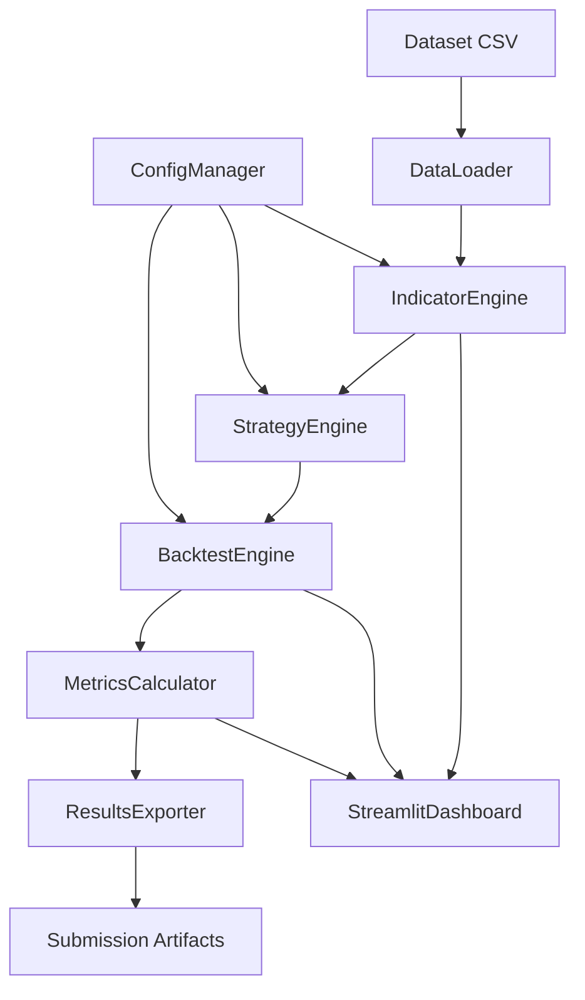
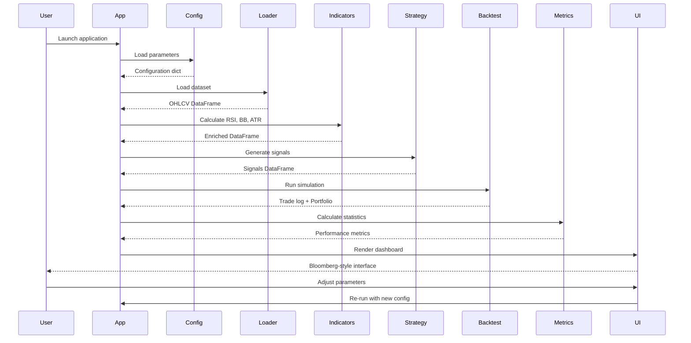

## Architectural Approach

### Core Design Principles

**1. Clean Architecture with Strict Separation of Concerns**

- **Core Logic Layer** (`core/`): Pure Python business logic with zero UI dependencies
  - Enables independent testing of strategy logic
  - Allows future migration to different UI frameworks
  - Facilitates code reuse across different execution contexts
- **Presentation Layer** (`ui/`): Streamlit-specific visualization and interaction
  - Consumes core layer through well-defined interfaces
  - Handles only display logic and user input
  - No business logic or calculations

**Trade-off:** Slightly more initial setup complexity vs. long-term maintainability and testability. Given the 30% code quality scoring weight, this investment pays off.

**2. Vectorized Operations for Performance**

- All indicator calculations and backtesting use pandas vectorized operations
- Avoid Python loops for time-series operations
- Pre-compute all indicators before strategy execution

**Rationale:** Demonstrates professional-grade quantitative programming. Judges will recognize the performance optimization approach.

**3. Configuration-Driven Design**

- Strategy parameters externalized to configuration files (YAML/JSON)
- Enables parameter tuning without code changes
- Auto-generates submission artifacts with exact parameters used

**Trade-off:** Additional configuration management vs. flexibility and reproducibility. Critical for hackathon submission requirements.

**4. Bloomberg Terminal Aesthetic**

- Monochromatic color scheme (black background, terminal green/red accents)
- Monospace fonts for all data displays
- High information density with minimal decorative elements
- Sharp edges, no gradients or rounded corners

**Rationale:** Institutional credibility and anti-AI-slop positioning. Judges will recognize professional trading platform design patterns.

### Technology Stack Decisions


| Component            | Technology                 | Rationale                                         |
| -------------------- | -------------------------- | ------------------------------------------------- |
| Core Engine          | Python 3.9+                | Industry standard for quantitative finance        |
| Data Processing      | pandas, numpy              | Vectorized operations, financial data handling    |
| Technical Indicators | Custom implementation      | Demonstrates understanding vs. library dependency |
| Backtesting          | Custom event-driven engine | Shows architectural thinking                      |
| UI Framework         | Streamlit                  | Rapid development, Python-native                  |
| Visualization        | Plotly                     | Interactive charts, professional appearance       |
| Configuration        | YAML                       | Human-readable, version-controllable              |


### Key Constraints

1. **Dataset Constraint:** Must use exclusively BatraHedge-provided dataset from [http://13.201.224.23:8001/](http://13.201.224.23:8001/)
2. **Time Constraint:** All deliverables due before 31st January 2026
3. **Submission Format:** GitHub repo, PDF documentation, UI link, backtesting results (CSV/JSON)
4. **Authenticity Requirement:** Development artifacts must reflect iterative student work patterns

### System Architecture



## Data Model

### Core Data Structures

**1. Market Data Schema**

```python
# OHLCV DataFrame structure
columns = ['timestamp', 'open', 'high', 'low', 'close', 'volume']
dtypes = {
    'timestamp': 'datetime64[ns]',
    'open': 'float64',
    'high': 'float64',
    'low': 'float64',
    'close': 'float64',
    'volume': 'float64'
}
```

**2. Indicator Data Schema**

```python
# Extended DataFrame with calculated indicators
additional_columns = [
    'rsi_14',           # RSI with 14-period
    'bb_upper',         # Upper Bollinger Band
    'bb_middle',        # Middle Bollinger Band (SMA)
    'bb_lower',         # Lower Bollinger Band
    'atr_14'            # Average True Range for position sizing
]
```

**3. Signal Data Schema**

```python
# Trading signals
signal_columns = [
    'signal',           # 1 (long), -1 (short), 0 (no signal)
    'signal_strength',  # Confidence score (0-1)
    'entry_price',      # Proposed entry price
    'stop_loss',        # Calculated stop-loss level
    'position_size'     # Shares/contracts based on risk
]
```

**4. Trade Log Schema**

```python
# Individual trade records
trade_record = {
    'trade_id': 'int',
    'entry_timestamp': 'datetime64[ns]',
    'exit_timestamp': 'datetime64[ns]',
    'direction': 'str',  # 'LONG' or 'SHORT'
    'entry_price': 'float64',
    'exit_price': 'float64',
    'position_size': 'float64',
    'pnl': 'float64',
    'pnl_percent': 'float64',
    'exit_reason': 'str'  # 'SIGNAL', 'STOP_LOSS', 'MAX_DD'
}
```

**5. Performance Metrics Schema**

```python
# Aggregated performance statistics
metrics = {
    'total_return': 'float',
    'annualized_return': 'float',
    'sharpe_ratio': 'float',
    'sortino_ratio': 'float',
    'max_drawdown': 'float',
    'max_drawdown_duration': 'int',  # days
    'win_rate': 'float',
    'profit_factor': 'float',
    'total_trades': 'int',
    'avg_trade_duration': 'float',  # hours
    'volatility': 'float'
}
```

### Data Flow

1. **Ingestion:** CSV → pandas DataFrame (validated schema)
2. **Enrichment:** OHLCV → OHLCV + Indicators
3. **Signal Generation:** Indicators → Trading Signals
4. **Execution Simulation:** Signals → Trade Log
5. **Analysis:** Trade Log → Performance Metrics
6. **Export:** All data structures → Submission artifacts

## Component Architecture

### Core Layer Components

**1. DataLoader (`core/loader.py`)**

- **Responsibility:** Load and validate dataset from BatraHedge URL
- **Interface:**
  - `load_dataset(url: str) -> pd.DataFrame`
  - `validate_schema(df: pd.DataFrame) -> bool`
  - `clean_data(df: pd.DataFrame) -> pd.DataFrame`
- **Integration:** Standalone, no dependencies on other core components

**2. IndicatorEngine (`core/indicators.py`)**

- **Responsibility:** Calculate technical indicators using vectorized operations
- **Interface:**
  - `calculate_rsi(prices: pd.Series, period: int) -> pd.Series`
  - `calculate_bollinger_bands(prices: pd.Series, period: int, std_dev: float) -> tuple`
  - `calculate_atr(df: pd.DataFrame, period: int) -> pd.Series`
- **Integration:** Consumes DataLoader output, feeds StrategyEngine

**3. StrategyEngine (`core/strategy.py`)**

- **Responsibility:** Implement "Volatility Sniper" mean reversion logic
- **Interface:**
  - `generate_signals(df: pd.DataFrame, config: dict) -> pd.DataFrame`
  - `calculate_position_size(signal: float, atr: float, capital: float) -> float`
- **Integration:** Consumes IndicatorEngine output, feeds BacktestEngine

**4. BacktestEngine (`core/backtester.py`)**

- **Responsibility:** Simulate trade execution with risk management
- **Interface:**
  - `run_backtest(signals: pd.DataFrame, config: dict) -> tuple[pd.DataFrame, dict]`
  - `apply_risk_management(trade: dict, portfolio: dict) -> dict`
- **Integration:** Consumes StrategyEngine signals, produces trade log and metrics

**5. MetricsCalculator (`core/metrics.py`)**

- **Responsibility:** Calculate performance statistics
- **Interface:**
  - `calculate_returns_metrics(trades: pd.DataFrame) -> dict`
  - `calculate_risk_metrics(trades: pd.DataFrame) -> dict`
  - `calculate_trade_metrics(trades: pd.DataFrame) -> dict`
- **Integration:** Consumes BacktestEngine output

**6. ConfigManager (`core/config.py`)**

- **Responsibility:** Load and validate configuration parameters
- **Interface:**
  - `load_config(path: str) -> dict`
  - `validate_config(config: dict) -> bool`
  - `export_config(config: dict, path: str) -> None`
- **Integration:** Used by all core components for parameterization

### Presentation Layer Components

**7. StreamlitDashboard (`ui/dashboard.py`)**

- **Responsibility:** Render Bloomberg Terminal-style interface
- **Interface:**
  - `render_control_panel() -> dict`  # Returns user-selected parameters
  - `render_metrics_cards(metrics: dict) -> None`
  - `render_price_chart(df: pd.DataFrame, trades: pd.DataFrame) -> None`
  - `render_trade_log(trades: pd.DataFrame) -> None`
- **Integration:** Consumes all core layer outputs, no business logic

**8. StyleManager (`ui/style.css` + `ui/theme.py`)**

- **Responsibility:** Enforce Bloomberg Terminal aesthetic
- **Interface:**
  - Custom CSS for Streamlit components
  - Color constants (BLACK, TERMINAL_GREEN, SIGNAL_RED)
  - Font specifications (monospace)
- **Integration:** Applied globally to all UI components

### Application Entry Point

**9. Main Application (`app.py`)**

- **Responsibility:** Orchestrate workflow and coordinate components
- **Workflow:**
  1. Load configuration
  2. Load and validate dataset
  3. Calculate indicators
  4. Generate trading signals
  5. Run backtest simulation
  6. Calculate performance metrics
  7. Render Streamlit dashboard
  8. Export submission artifacts
- **Integration:** Coordinates all components, implements end-to-end flow

### Component Interaction Flow



### File Structure

```
algo hack/
├── data/
│   └── dataset.csv              # Downloaded from BatraHedge
├── core/
│   ├── __init__.py
│   ├── config.py                # Configuration management
│   ├── loader.py                # Data loading and validation
│   ├── indicators.py            # Technical indicator calculations
│   ├── strategy.py              # Volatility Sniper logic
│   ├── backtester.py            # Simulation engine
│   └── metrics.py               # Performance calculations
├── ui/
│   ├── __init__.py
│   ├── dashboard.py             # Streamlit components
│   ├── style.css                # Bloomberg Terminal CSS
│   └── theme.py                 # Color and font constants
├── config/
│   └── strategy_config.yaml     # Strategy parameters
├── output/
│   ├── backtest_results.csv     # Raw results for submission
│   ├── trade_log.csv            # Trade-by-trade log
│   └── config_used.yaml         # Parameters snapshot
├── app.py                       # Main entry point
├── requirements.txt             # Dependencies
└── README.md                    # Setup and usage instructions
```

### Key Design Decisions

1. **No External Indicator Libraries:** Custom implementation demonstrates understanding
2. **Event-Driven Backtesting:** More realistic than vectorized backtesting for risk management
3. **Immutable Data Flow:** Each component returns new data structures, no mutations
4. **Configuration as Code:** YAML files version-controlled alongside code
5. **Automated Export:** Submission artifacts generated automatically, ensuring consistency

